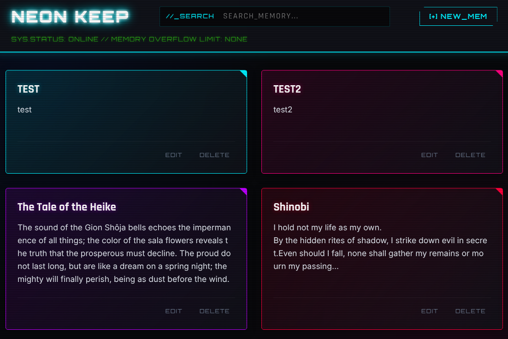

# NEON KEEP // SECURE

[](https://opensource.org/licenses/MIT)

**NEON KEEP** is a self-hosted web note-taking application featuring a stunning cyberpunk aesthetic, glowing neon visual feedback, and strong access control.

It offers a lightweight and fast user experience similar to Google Keep, designed with a premium glassmorphic UI that is optimized for both desktop and mobile devices.



---

## 🚀 Key Features

* **🔐 Built-in Basic Authentication**
  - First-time boot automatically redirects to the Master Account Setup screen where you choose your admin credentials.
  - Secures your notes using `bcrypt` password hashing and `JWT` (JSON Web Token) sessions stored in an HTTPOnly cookie.
* **🎨 Neon & Glassmorphism UI**
  - Vibrant neon color palette, glowing outlines, and color chips that match your notes' themes.
  - Real-time instant search (`//_SEARCH`) that filters your kept memories as you type.
* **📦 Intuitive Drag & Drop Reordering**
  - Rearrange note cards via smooth drag-and-drop (order persists automatically in the SQLite database).
  - Touchscreen optimization (mobile devices require a 200ms long-press to begin dragging, preventing conflicts with normal page scrolling).
* **🐳 Docker & Docker Compose Ready**
  - Spin up the entire system with a single command without worrying about dependencies.

---

## ⚡ Quick Start (Docker Compose)

The easiest way to get up and running. Create a `docker-compose.yml` file on your server:

```yaml
version: '3.8'

services:
  neonkeep:
    image: ghcr.io/yourusername/neonkeep-pub:latest  # Replace with your built image name
    container_name: neonkeep
    ports:
      - "8000:8000"
    volumes:
      - ./data:/app/data
    environment:
      - DATABASE_URL=sqlite:////app/data/sql_app.db
      - JWT_SECRET=change_this_to_a_secure_random_string_in_production  # Replace this with a long random string
    restart: always
```

Run the following command in the same directory:

```bash
docker compose up -d
```

Once started, navigate to `http://localhost:8000` in your browser. You will be automatically redirected to the initial setup page.

---

## 🛠️ Local Development Setup

If you wish to run and modify NEON KEEP locally using Python and `uv`:

### 1. Set Up Dependencies
```bash
git clone https://github.com/yourusername/neonkeep-pub.git
cd neonkeep-pub
uv sync
```

### 2. Run the App
```bash
uv run uvicorn main:app --reload --host 127.0.0.1 --port 8000
```

---

## 📄 License

This project is licensed under the **MIT License**. Feel free to customize and deploy your own personal secure note server!
